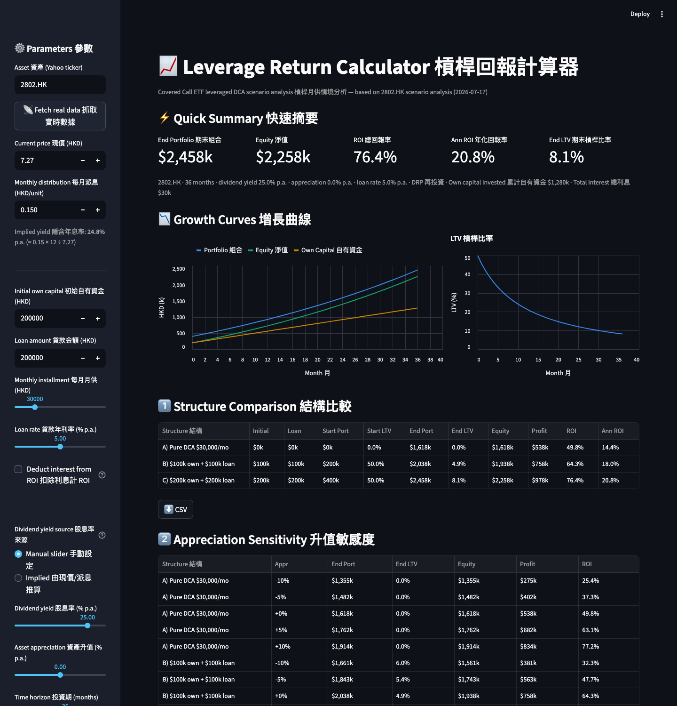

# 📈 Leverage Return Calculator 槓桿回報計算器


Interactive Streamlit tool for analyzing **leveraged DCA strategies on high-yield
covered call ETFs** (e.g. 2802.HK). Models monthly installments, revolving
interest-only loans, and dividend reinvestment across 9 scenario tables.

互動式槓桿月供情境分析工具 — 模擬高息備兌認購 ETF 的月供 + 循環貸款策略,
即時計算 9 個情境表格。



## Features 功能

- ⚡ **Quick Summary** — End Portfolio / Equity / ROI / Annualized ROI / LTV
- 📉 **Growth curves 增長曲線** — Portfolio vs Equity vs Own Capital, plus LTV
  decay chart (hover tooltips)
- 9 scenario tables 情境表格, each with **CSV download** ⬇️:
  1. Structure Comparison 結構比較(Pure DCA vs Leveraged)
  2. Appreciation Sensitivity 升值敏感度
  3. Loan Rate Sensitivity 貸款利率敏感度
  4. Dividend Yield Sensitivity 股息率敏感度
  5. Time Horizon Projection 投資期預測
  6. LTV Milestone Timeline 槓桿比率里程碑
  7. Loan Breakeven Analysis 貸款回本分析
  8. Monthly Cash Flow Timeline 每月現金流
  9. Appreciation × Dividend Yield Matrix 熱力圖
- 📡 **Live data fetch 實時數據** — pulls last price & latest distribution from
  Yahoo Finance by ticker (via `yfinance`, no API key)
- 🔗 **Shareable links 分享連結** — the URL always carries the current
  parameters; copy it to share an exact scenario
- 🎚️ **Interest toggle** — optionally deduct cumulative loan interest from
  profit/ROI 可切換扣除利息計 ROI
- Dividend yield source: manual slider or implied from price/distribution
- Dividend treatment: Reinvest (DRP) or Cash 股息再投資/現金
- Dark theme, bilingual labels 深色主題、中英雙語

## Quick Start

```bash
pip install -r requirements.txt
streamlit run app.py        # or: python3 -m streamlit run app.py
```

Open http://localhost:8501 (or specify `--server.port 8511`).

## Math Model 計算模型

Monthly compounding, contribution added before growth (annuity-due):

```
y  = dividend_yield / 12               (simple monthly rate)
g  = (1 + appreciation)^(1/12) − 1     (geometric monthly rate)

each month:
  base = portfolio + installment
  div  = base × (1+g) × y
  DRP:  portfolio = base × (1+g) × (1+y)
  Cash: portfolio = base × (1+g);  dividends accumulate as cash

Own Capital = initial capital + installment × months
Equity      = portfolio + cash dividends − loan principal
Profit      = Equity − Own Capital  [− cumulative interest if toggle on]
ROI         = Profit ÷ Own Capital
Ann ROI     = (1 + ROI)^(12/months) − 1
```

The loan is revolving and interest-only. By default interest affects cash flow
but is **not** deducted from ROI (source-analysis convention, shown separately
as Total Interest); enable the sidebar toggle to net it out.
貸款為循環式只還息;預設利息只影響現金流、不扣入 ROI,可用開關切換。

## Tests 測試

The calculation engine is verified against the original 2802.HK scenario
analysis (80+ reference values across all 9 tables). CI runs the suite on
every push.

```bash
python3 -m pytest tests/ -v
```

> Known note: Table 7 cell "B structure @ −10% appreciation" computes M13 here
> vs M12 in the original analysis — the original value is inconsistent with its
> own stated definition (cumulative dividends at M12 fall ~$1.5k short of
> principal + interest); this app uses the strict definition.

## Disclaimer 免責聲明

For scenario simulation only — **not investment advice**. Covered call ETFs
sacrifice upside and may erode NAV; high yields come from option premium, not
earnings growth. See the caveats section in the app.

本工具僅供情境模擬,不構成投資建議。

## License

[MIT](LICENSE) © 2026 Cadmus Yiu (ChocoInvest)
